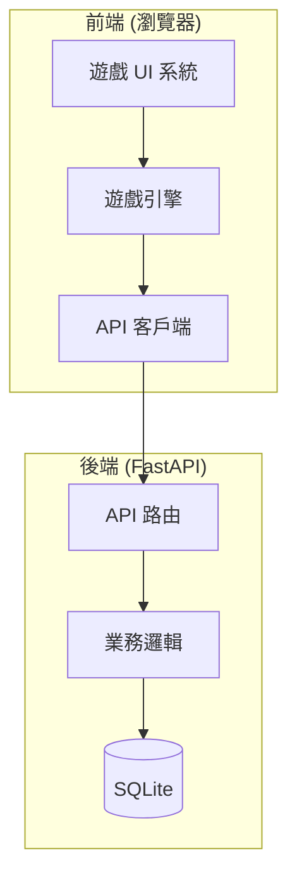
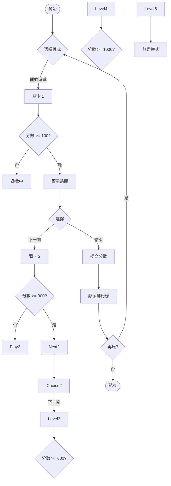

# 🐍 貪食蛇遊戲 - 專案規格書

## 1. 專案概述

### 專案名稱
**Snake Fantasy** - 夢幻貪食蛇遊戲

### 專案類型
全端 Web 遊戲應用 (後端 API + 前端互動式遊戲)

### 核心功能
- 5 關卡多層次貪食蛇遊戲
- 即時分數記錄與排名系統
- 遊戲結束後姓名輸入儲存
- 華麗 Fantasy 視覺風格

### 目標用戶
休閒遊戲玩家，喜歡經典遊戲的現代化詮釋

---

## 2. 技術架構

### 系統架構圖


### 技術選型

| 層面 | 技術 | 版本 |
|------|------|------|
| 後端框架 | FastAPI | 0.109+ |
| 資料庫 | SQLite | 3.x |
| 前端框架 | Vanilla JS (ES6+) | - |
| 圖形渲染 | HTML5 Canvas | - |
| 樣式 | CSS3 (Variables, Animations) | - |
| 部署 | 單一 Python 進程 | - |

### 目錄結構
```
/work/c00cjz00/antigravity/roocode/
├── backend/
│   ├── main.py           # FastAPI 主應用
│   ├── models.py         # 資料庫模型
│   ├── database.py       # 資料庫連接
│   └── requirements.txt  # Python 依賴
├── frontend/
│   ├── index.html        # 遊戲主頁面
│   ├── css/
│   │   └── style.css     # 樣式表
│   └── js/
│       ├── game.js       # 遊戲引擎
│       ├── renderer.js   # 渲染系統
│       ├── api.js        # API 客戶端
│       └── ui.js         # UI 控制
└── SPEC.md               # 本規格文件
```

---

## 3. 資料庫設計

### 資料表結構

#### Table: `scores`
記錄遊戲分數資料

| 欄位 | 類型 | 說明 |
|------|------|------|
| id | INTEGER PRIMARY KEY | 自動遞增 ID |
| player_name | VARCHAR(50) | 玩家名稱 |
| score | INTEGER | 最終分數 |
| level | INTEGER | 通過關卡數 (1-5) |
| play_time | INTEGER | 遊戲時長 (秒) |
| created_at | DATETIME | 創建時間 |

### SQL Schema
```sql
CREATE TABLE IF NOT EXISTS scores (
    id INTEGER PRIMARY KEY AUTOINCREMENT,
    player_name VARCHAR(50) NOT NULL,
    score INTEGER NOT NULL,
    level INTEGER NOT NULL DEFAULT 1,
    play_time INTEGER NOT NULL DEFAULT 0,
    created_at DATETIME DEFAULT CURRENT_TIMESTAMP
);

CREATE INDEX idx_scores_score ON scores(score DESC);
CREATE INDEX idx_scores_level ON scores(level DESC);
```

---

## 4. 後端 API 設計

### API 端點

#### 4.1 提交分數
```
POST /api/v1/scores
```

**請求體:**
```json
{
    "player_name": "玩家名稱",
    "score": 1500,
    "level": 3,
    "play_time": 180
}
```

**響應 (201):**
```json
{
    "success": true,
    "data": {
        "id": 1,
        "player_name": "玩家名稱",
        "score": 1500,
        "level": 3,
        "play_time": 180,
        "created_at": "2026-02-21T16:00:00"
    }
}
```

#### 4.2 獲取排行榜
```
GET /api/v1/scores?limit=10&offset=0
```

**查詢參數:**
- `limit`: 每次返回數量 (預設 10)
- `offset`: 偏移量 (預設 0)

**響應 (200):**
```json
{
    "success": true,
    "data": [
        {
            "id": 1,
            "player_name": "玩家A",
            "score": 5000,
            "level": 5,
            "play_time": 300,
            "created_at": "2026-02-21T16:00:00"
        }
    ],
    "pagination": {
        "page": 1,
        "limit": 10,
        "total": 100
    }
}
```

#### 4.3 獲取單筆分數
```
GET /api/v1/scores/{id}
```

**響應 (200):**
```json
{
    "success": true,
    "data": {
        "id": 1,
        "player_name": "玩家A",
        "score": 5000,
        "level": 5,
        "play_time": 300,
        "created_at": "2026-02-21T16:00:00"
    }
}
```

### 錯誤響應格式
```json
{
    "success": false,
    "error": {
        "code": "VALIDATION_ERROR",
        "message": "玩家名稱不能為空"
    }
}
```

### 驗證規則
- `player_name`: 1-50 字元，必填
- `score`: 正整數，必填
- `level`: 1-5 整數，必填
- `play_time`: 正整數，必填

---

## 5. 遊戲關卡設計

### 5 關卡詳細規格

| 關卡 | 名稱 | 蛇速 | 食物分數 | 特殊障礙 | 目標分數 |
|------|------|------|----------|----------|----------|
| 1 | 翠綠森林 | 慢 (150ms) | 10 | 無 | 100 |
| 2 | 幽暗洞穴 | 中 (120ms) | 15 | 隨機障礙物 | 300 |
| 3 | 火焰地獄 | 中快 (100ms) | 20 | 移動障礙物 | 600 |
| 4 | 冰雪王國 | 快 (80ms) | 25 | 冰凍陷阱 | 1000 |
| 5 | 最終試煉 | 極快 (60ms) | 30 | 混合障礙 | 1500 |

### 關卡過關條件
- 達到目標分數後，顯示「進入下一關」按鈕
- 玩家可選擇繼續挑戰或結束遊戲
- 關卡 5 為最終關卡，無盡模式

### 障礙物系統
- **靜態障礙**: 灰色方塊，蛇無法穿過
- **移動障礙**: 紅色方塊，定時移動
- **冰凍陷阱**: 藍色區域，暫時凍住蛇 2 秒

---

## 6. 前端 UI/UX 設計

### 6.1 視覺風格 - Fantasy Neon

#### 色彩系統
```css
:root {
    /* 主色調 - 霓虹紫 */
    --primary: #9d4edd;
    --primary-light: #c77dff;
    --primary-dark: #7b2cbf;
    
    /* 強調色 - 霓虹青 */
    --accent: #00f5d4;
    --accent-light: #72efdd;
    
    /* 背景色 */
    --bg-dark: #10002b;
    --bg-medium: #240046;
    --bg-light: #3c096c;
    
    /* 文字色 */
    --text-primary: #ffffff;
    --text-secondary: #e0aaff;
    
    /* 遊戲元素色 */
    --snake-head: #ff6b6b;
    --snake-body: #4ecdc4;
    --food: #ffd93d;
    --obstacle: #6c757d;
    --trap: #74c0fc;
}
```

#### 字體
- 標題: "Orbitron", sans-serif (Google Fonts)
- 內文: "Rajdhani", sans-serif (Google Fonts)

### 6.2 頁面結構

#### 遊戲主頁面
```
┌─────────────────────────────────────────┐
│  🐍 SNAKE FANTASY          [排行榜] [設定] │
├─────────────────────────────────────────┤
│                                         │
│         ┌─────────────────┐             │
│         │   遊戲畫布      │             │
│         │   (Canvas)      │             │
│         └─────────────────┘             │
│                                         │
│  分數: 0    關卡: 1    時間: 00:00       │
│                                         │
│         [ 開始遊戲 ]                     │
│                                         │
└─────────────────────────────────────────┘
```

#### 遊戲進行中
```
┌─────────────────────────────────────────┐
│  🐍 SNAKE FANTASY           [暫停] [結束] │
├─────────────────────────────────────────┤
│                                         │
│         ┌─────────────────┐             │
│         │   遊戲畫布      │             │
│         │   + 粒子效果    │             │
│         │   + 光暈效果    │             │
│         └─────────────────┘             │
│                                         │
│  ═══════════════════════════════════    │
│  分數: 150   關卡: 2   時間: 01:23      │
│  ═══════════════════════════════════    │
│                                         │
└─────────────────────────────────────────┘
```

#### 遊戲結束 / 排行榜
```
┌─────────────────────────────────────────┐
│  🐍 SNAKE FANTASY                       │
├─────────────────────────────────────────┤
│                                         │
│     🎮 遊戲結束                         │
│     最終分數: 850                        │
│     通過關卡: 3                          │
│                                         │
│     請輸入您的名稱:                     │
│     ┌─────────────────┐                 │
│     │ [___________]   │                 │
│     └─────────────────┘                 │
│                                         │
│     [ 提交分數 ]  [ 再玩一次 ]           │
│                                         │
├─────────────────────────────────────────┤
│     🏆 排行榜 TOP 10                    │
│  ┌─────────────────────────────────┐    │
│  │ 1. 玩家A    5000分  5關  5:00   │    │
│  │ 2. 玩家B    4200分  5關  4:30   │    │
│  │ 3. 玩家C    3800分  4關  3:45   │    │
│  │ ...                              │    │
│  └─────────────────────────────────┘    │
└─────────────────────────────────────────┘
```

### 6.3 視覺效果

#### 遊戲元素渲染
- **蛇**: 漸變色身體，頭部有眼睛動畫
- **食物**: 閃爍發光效果，收集時爆炸粒子
- **障礙物**: 帶有光暈的幾何形狀
- **背景**: 網格線 + 動態星空粒子

#### 動畫效果
- 食物收集: 爆炸粒子 + 縮放動畫
- 關卡升級: 螢幕閃爍 + 文字飛入
- 蛇移動: 殘影效果
- UI 轉場: 淡入淡出

### 6.4 控制方式

#### 鍵盤控制
- `↑` / `W`: 向上移動
- `↓` / `S`: 向下移動
- `←` / `A`: 向左移動
- `→` / `D`: 向右移動
- `Space`: 暫停/繼續
- `Enter`: 確認/開始

#### 觸控控制 (行動裝置)
- 虛擬方向鍵 (左下角)
- 暫停按鈕 (右上角)

---

## 7. 功能流程

### 7.1 遊戲流程圖


### 7.2 分數提交流程
1. 遊戲結束
2. 顯示最終分數、關卡、時間
3. 玩家輸入名稱 (1-50 字元)
4. 點擊「提交分數」
5. API 調用成功後更新排行榜
6. 顯示提交成功訊息

---

## 8. 驗收標準

### 功能驗收
- [ ] 後端 API 正確處理分數提交
- [ ] 後端 API 正確返回排行榜
- [ ] 前端遊戲流暢運行 (60 FPS)
- [ ] 5 個關卡正確切換
- [ ] 障礙物正確生成與碰撞檢測
- [ ] 遊戲結束可輸入姓名並提交
- [ ] 排行榜正確顯示

### 視覺驗收
- [ ] Fantasy 霓虹風格一致
- [ ] 動畫流暢無卡頓
- [ ] 響應式設計 (桌面/平板)
- [ ] 遊戲元素清晰可見

### 效能驗收
- [ ] 頁面載入時間 < 2 秒
- [ ] 遊戲延遲 < 16ms
- [ ] API 響應時間 < 500ms

---

## 9. 開發順序

1. **後端開發**
   - 設定 FastAPI 專案
   - 建立 SQLite 資料庫
   - 實作 API 端點
   - 測試 API 功能

2. **前端基礎**
   - 建立 HTML 結構
   - 實作 CSS 樣式
   - 建立 Canvas 遊戲框架

3. **遊戲引擎**
   - 實作蛇的移動邏輯
   - 實作食物生成與碰撞
   - 實作 5 個關卡
   - 實作障礙物系統

4. **UI/UX**
   - 加入視覺效果
   - 加入排行榜顯示
   - 加入遊戲結束流程

5. **整合測試**
   - 後端與前端整合
   - 功能測試
   - 效能優化
